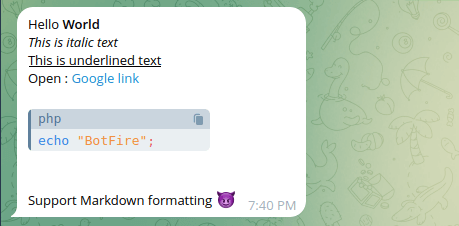
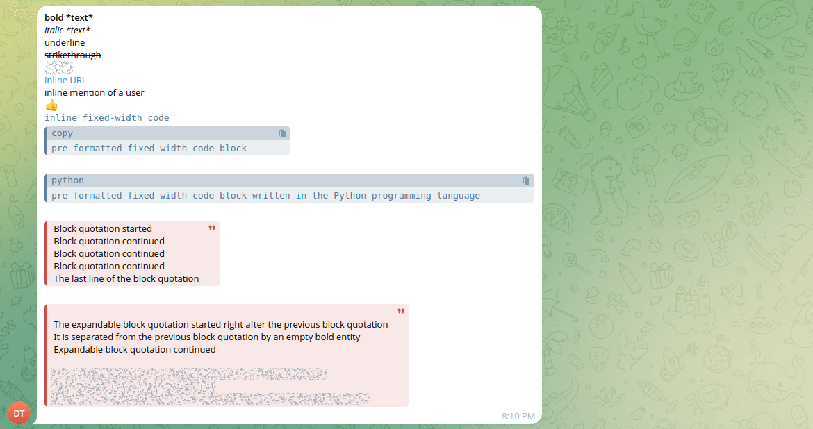

# Markdown Builder Documentation

## Overview

The `MarkdownBuilder` class is a modern PHP utility designed to generate Telegram-compatible Markdown text. It provides a fluent, chainable interface to create formatted text, including bold, italic, code blocks, block quotes, and more.

> This works based on [MarkdownV2 style](https://core.telegram.org/bots/api#markdownv2-style)

**Require the Class**:

```php
use Botfire\Helper\MarkdownBuilder;
```

## Usage

The `MarkdownBuilder` class supports method chaining for a fluent API. Below are some common usage examples.

### Basic Example

```php
$builder = new MarkdownBuilder();
$builder
    ->text('Hello ')->bold('World')->newLine()
    ->italic('This is italic text')->newLine()
    ->underline('This is underlined text')->newLine()
    ->text('Open : ')->url('Google link', 'https://www.google.com')
    ->newLine(2)
    ->code('echo "BotFire";', 'php')
    ->newLine(2)
    ->text('Support Markdown formatting 😈');


$msg = Message::create($builder);
$msg->chatId(123456789);

Bot::sendMessage($msg);
```

**Output**:




## API Reference

Here’s a quick guide to the methods available in `MarkdownBuilder`. Each method is designed to be intuitive and chainable, so you can mix and match to create the perfect message!

### `text(string $text): self`
Adds plain text to your message.

- **What it does**: Appends unformatted text.
- **Example**:
  ```php
  $builder->text('Hello');
  ```

### `bold(string $text): self`
Makes text **bold** using `*text*`.

- **What it does**: Wraps text in asterisks for bold formatting.
- **Example**:
  ```php
  $builder->bold('World');
  ```

### `italic(string $text): self`
Makes text *italic* using `_text_`.

- **What it does**: Wraps text in underscores for italic formatting.
- **Example**:
  ```php
  $builder->italic('Hello');
  ```

### `underline(string $text): self`
Underlines text using `__text__`.

- **What it does**: Adds double underscores for underlined text.
- **Example**:
  ```php
  $builder->underline('Underlined');
  ```

### `strikethrough(string $text): self`
Strikes through text using `~text~`.

- **What it does**: Wraps text in tildes for strikethrough effect.
- **Example**:
  ```php
  $builder->strikethrough('Deleted');
  ```

### `spoiler(string $text): self`
Hides text as a spoiler using `||text||`.

- **What it does**: Wraps text in double pipes for a clickable spoiler.
- **Example**:
  ```php
  $builder->spoiler('Secret');
  ```

### `inlineCode(string $code): self`
Formats text as `inline code` using backticks.

- **What it does**: Wraps code in single backticks for inline fixed-width formatting.
- **Example**:
  ```php
  $builder->inlineCode('var x = 10');
  ```

### `code(string $code, string $language = ''): self`
Creates a code block, optionally with a language identifier.

- **What it does**: Wraps code in triple backticks, with an optional language (e.g., `python`, `php`).
- **Example**:
  ```php
  $builder->code('print("Hello")', 'python');
  ```
- **Output**:
  ```
  ```python
  print("Hello")
  ```
  ```

### `quote(string $text): self`
Adds a block quote using `> ` for each line.

- **What it does**: Prefixes each line with `>` for a quotation style.
- **Example**:
  ```php
  $builder->quote("Line 1\nLine 2");
  ```
- **Output**:
  ```
  > Line 1
  > Line 2
  ```

### `expandableQuote(string $visibleText, string $hiddenText = ''): self`
Creates an expandable block quote with optional hidden content.

- **What it does**: Formats a quote with a visible part and an optional hidden part (revealed on click).
- **Example**:
  ```php
  $builder->expandableQuote('Visible part', 'Hidden part');
  ```

  

### `url(string $text, string $url): self`
Creates a clickable link using `[text](url)`.

- **What it does**: Links text to a URL. Throws an error if the URL is invalid.
- **Example**:
  ```php
  $builder->url('Example', 'http://example.com');
  ```

### `mention(string $text, int $userId): self`
Mentions a Telegram user using `[text](tg://user?id=userId)`.

- **What it does**: Creates a clickable mention for a Telegram user.
- **Example**:
  ```php
  $builder->mention('User', 123456789);
  ```

### `emoji(string $emoji, string $emojiId): self`
Adds a Telegram emoji using `[emoji](tg://emoji?id=emojiId)`.

- **What it does**: Inserts a custom Telegram emoji.
- **Example**:
  ```php
  $builder->emoji('👍', '5368324170671202286');
  ```

### `newLine(int $count = 1): self`
Adds one or more new lines (`\n`).

- **What it does**: Inserts line breaks to separate content.
- **Example**:
  ```php
  $builder->newLine(2);
  ```

### `build(): string`
Finalizes and returns the Markdown string.

- **What it does**: Returns the complete formatted text.
- **Example**:
  ```php
  $markdown = $builder->build();
  ```

## Other Example

```php
    $builder = new MarkdownBuilder();
    $builder
    ->bold('bold *text*')->newLine()
    ->italic('italic *text*')->newLine()
    ->underline('underline')->newLine()
    ->strikethrough('strikethrough')->newLine()
    ->spoiler('spoiler')->newLine()
    ->url('inline URL', 'http://www.example.com/')->newLine()
    ->mention('inline mention of a user', 123456789)->newLine()
    ->emoji('👍', '5368324170671202286')->newLine()
    ->inlineCode('inline fixed-width code')->newLine()
    ->code('pre-formatted fixed-width code block')->newLine()
    ->code('pre-formatted fixed-width code block written in the Python programming language', 'python')->newLine()
    ->quote("Block quotation started\nBlock quotation continued\nBlock quotation continued\nBlock quotation continued\nThe last line of the block quotation")->newLine()
    ->expandableQuote(
        "The expandable block quotation started right after the previous block quotation\nIt is separated from the previous block quotation by an empty bold entity\nExpandable block quotation continued",
        "Hidden by default part of the expandable block quotation started\nExpandable block quotation continued\nThe last line of the expandable block quotation with the expandability mark"
    );
```

### Output


